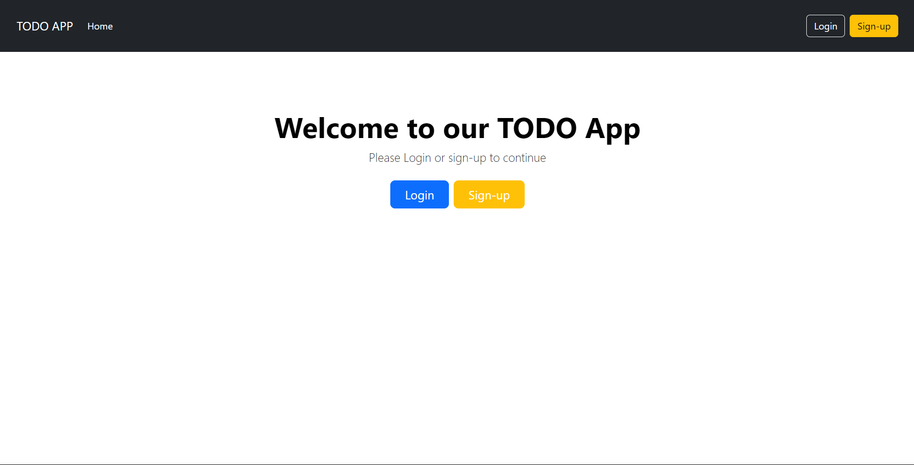

# Todo App

Todo App is a Full Stack Application built using ReactJS, NodeJS, ExpressJS, MongoDB, and Bootstrap. This application allows users to sign in, sign up, add, and delete todos.

## Features

- **User Authentication**: Secure login and registration for users.
- **Add & Delete Todos**: Users can add new todos with a title, task description, and due date, as well as delete existing todos.
- **Responsive Design**: The application is responsive and works on different devices.

## Technologies Used

- **Frontend**: ReactJS, Bootstrap
- **Backend**: NodeJS, ExpressJS, MongoDB, Mongoose
- **API**: RESTful API

## Screenshots



## Project Structure

The project has the following structure:

    root
    │   README.md
    │   Images
    │   ...
    └───Frontend
    │   └───src
    │       └───components
    │       └───App.jsx
    │       └───...
    └───Backend
        └───controllers
        └───models
        └───routes
        └───...

## Getting Started

### Prerequisites

- Node.js
- MongoDB

### Installation

1. Clone the repository:
    ```sh
    git clone https://github.com/your-username/your-repository.git
    ```

2. Navigate to the backend directory and install dependencies:
    ```sh
    cd backend
    npm install
    ```

3. Navigate to the frontend directory and install dependencies:
    ```sh
    cd ../frontend
    npm install
    ```

4. Create a `.env` file in the backend directory and add your MongoDB URI and other environment variables:
    ```sh
    MONGODB_URI=your_mongodb_uri
    PORT=8000
    ```

### Running the Application

1. Start the backend server:
    ```sh
    cd Backend
    npm run dev
    ```

    Open Another Terminal...

2. Start the frontend development server:
    ```sh
    cd Frontend
    npm run dev
    ```

3. Open your browser and navigate to:
    ```sh
    http://localhost:5173
    ```

## Contributing

Feel free to fork this repository and submit pull requests. For major changes, please open an issue first to discuss what you would like to change.
